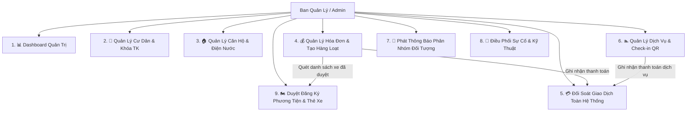

# Đặc Tả Thiết Kế: Hệ Sinh Thái Quản Trị Ban Quản Lý (PKA Home Admin)

**Tác giả:** Đội ngũ Phát triển PKA Home  
**Ngày lập:** 05/10/2026  
**Trạng thái:** Đã phê duyệt (Approved)  
**Tài liệu tham chiếu:** [`docs/superpowers/specs/2026-10-05-unified-finance-and-amenity-services-design.md`](file:///c:/Users/ADMIN/StudioProjects/pka_home/docs/superpowers/specs/2026-10-05-unified-finance-and-amenity-services-design.md)

---

## 1. Bối Cảnh & Mục Tiêu Nghiệp Vụ

Trong mô hình quản lý chung cư thông minh PKA Home, vai trò Ban Quản Lý (Admin / Management) là trung tâm điều phối toàn bộ hoạt động của tòa nhà. Hệ thống cần đáp ứng mô hình 2 chiều:
> **Cư dân sử dụng dịch vụ $\rightarrow$ Admin quản lý dữ liệu, kiểm soát, xác nhận và theo dõi báo cáo.**

### Mục tiêu cốt lõi:
1. **Trực quan hóa tổng thể**: Cung cấp Dashboard đo lường tức thời sức khỏe tài chính, tiến độ thu phí, lượng booking dịch vụ và sự cố tồn đọng.
2. **Tự động hóa tác vụ định kỳ**: Cung cấp tính năng đột phá **"Tạo hóa đơn hàng loạt theo tháng (Bulk Generation)"** chỉ với 1 cú nhấp chuột cho toàn bộ căn hộ có người ở, tự động cộng dồn phí quản lý, phí xe đã duyệt và điện nước.
3. **Quản trị 360° cư dân & căn hộ**: Tra cứu đầy đủ thông tin nhân khẩu, xe cộ, công nợ và dịch vụ đang dùng; hỗ trợ khóa tài khoản vi phạm.
4. **Đối soát giao dịch minh bạch**: Quản lý tập trung toàn bộ giao dịch thanh toán mô phỏng (`DEMO-...`) cho cả hóa đơn và dịch vụ tiện ích.
5. **Vận hành tiện ích & Check-in QR**: Ban quản lý quản lý lịch đặt sân/phòng, thực hiện **Check-in** khi cư dân xuất trình mã QR.
6. **Điều phối sự cố & Phê duyệt phương tiện**: Tiếp nhận sự cố kỹ thuật, phân công nhân sự và kiểm duyệt xe gửi tại bãi đỗ.

---

## 2. Kiến Trúc 9 Phân Hệ Quản Trị



---

### Phân hệ 1: 📊 Dashboard Quản Trị Trung Tâm

* **Vị trí**: Tab đầu tiên của Ban Quản Lý (`ManagementHomeScreen`).
* **KPI Header Cards**:
  * 👥 **Tổng cư dân**: `356` cư dân đã đăng ký.
  * 🏠 **Tổng căn hộ**: `280 / 300` căn hộ đang có người ở.
  * 💰 **Doanh thu tháng 10/2026**: `82.500.000 đ` (tính từ các giao dịch thành công).
  * 📅 **Lượt đặt tiện ích hôm nay**: `24` lượt đặt sân/gym/bơi.
  * ⚠️ **Phản ánh chưa xử lý**: `5` sự cố đang ở trạng thái `pending`.
* **Tiến độ thu phí tháng (Visual Progress Bar)**:
  * Hiển thị tỷ lệ thanh toán: `82% đã thanh toán` (`230 / 280 căn hộ`).
  * Chia nhỏ phân đoạn: 230 đã đóng (xanh lá) | 45 chưa thanh toán (cam) | 5 quá hạn (đỏ).
* **Danh sách giao dịch gần nhất (Recent Transactions Stream)**:
  * Hiển thị danh sách 5 giao dịch mô phỏng mới nhất: Căn hộ (VD: `A0101`, `B0203`), Số tiền, Loại giao dịch (Hóa đơn / Dịch vụ), Trạng thái (`Thành công`), Thời gian giao dịch.
* **Thanh tác vụ nhanh (Quick Actions)**:
  * Nút "Tạo HĐ hàng loạt" | "Đăng thông báo" | "Duyệt yêu cầu cư dân" | "Duyệt thẻ xe".

---

### Phân hệ 2: 👥 Quản Lý Cư Dân & Khóa Tài Khoản

* **Danh sách cư dân**:
  * Tìm kiếm theo tên, số điện thoại, mã căn hộ.
  * Bộ lọc vai trò: `Tất cả` | `Chủ hộ` | `Thành viên` | `Khách thuê`.
  * Bộ lọc trạng thái: `🟢 Đang hoạt động` | `🔴 Đã khóa`.
* **Khóa / Mở khóa tài khoản**:
  * Nút chuyển đổi trạng thái tài khoản cư dân (bật/tắt cờ `is_locked` trong bảng `users`).
  * Khi tài khoản bị khóa, cư dân không thể đăng nhập hoặc thao tác ứng dụng.
* **Chi tiết hồ sơ cư dân (Resident 360 View)**:
  * Xem họ tên, số điện thoại, email, vai trò và căn hộ liên kết.
  * **Mục Phương tiện**: Danh sách xe máy, ô tô đã được BQL duyệt của cư dân.
  * **Mục Hóa đơn**: Lịch sử các hóa đơn gắn với căn hộ của cư dân.
  * **Mục Dịch vụ**: Các dịch vụ tiện ích cư dân đang sử dụng hoặc lịch đặt sắp tới.

---

### Phân hệ 3: 🏠 Quản Lý Căn Hộ & Chỉ Số Tiện Ích

* **Cấu trúc phân tầng**:
  * Nhóm theo Block / Tòa: Tòa A (`A0101` $\rightarrow$ `A1510`), Tòa B (`B0101` $\rightarrow$ `B1510`).
  * Lọc theo trạng thái: `Đang có người ở` vs `Căn hộ trống`.
* **Chi tiết căn hộ**:
  * Diện tích sàn ($m^2$), Chủ hộ hiện tại, Số lượng nhân khẩu cư trú.
  * **Ghi nhận chỉ số tiện ích tháng**: Form cập nhật số điện ($kWh$) và số nước ($m^3$) tháng hiện tại để sẵn sàng lập hóa đơn.

---

### Phân hệ 4: 💰 Quản Lý Hóa Đơn & Tạo Hàng Loạt (Bulk Invoicing)

* **Tạo hóa đơn hàng loạt (Bulk Generation RPC)**:
  * Chọn kỳ hóa đơn: `10/2026`.
  * Chọn hạn thanh toán: `20/10/2026`.
  * Cấu hình biểu phí:
    * Phí quản lý vận hành: $10.000 đ / m^2$ (tính theo diện tích căn hộ).
    * Phí gửi xe: Tự động đếm số lượng xe đã duyệt của căn hộ ($100.000 đ / xe máy$, $1.200.000 đ / ô tô$).
    * Điện tiêu thụ: Số $kWh \times 3.000 đ$ (hoặc khoán cố định).
    * Nước tiêu thụ: Số $m^3 \times 15.000 đ$ (hoặc khoán cố định).
  * Nút **[ XÁC NHẬN TẠO HÓA ĐƠN TOÀN BỘ CĂN HỘ ]**:
    * Hệ thống kích hoạt RPC tự động lặp qua toàn bộ căn hộ có cư dân đang ở (`is_empty = false`), tạo hóa đơn cha (`invoices`) và các khoản mục con (`invoice_items`).
* **Theo dõi & Lọc trạng thái**:
  * Thống kê trực quan: Tổng số hóa đơn, Đã thanh toán, Chưa thanh toán, Quá hạn.
  * Tính năng gửi thông báo nhắc nợ hàng loạt tới các căn chưa thanh toán.

---

### Phân hệ 5: 💳 Đối Soát Giao Dịch Toàn Hệ Thống (Payment Audit)

* Màn hình quản lý riêng: `ManagementPaymentTransactionsScreen`.
* Danh sách toàn bộ các giao dịch phát sinh từ `payment_transactions`.
* Hiển thị bảng/thẻ thông tin:
  * Mã giao dịch: `DEMO-YYYYMMDD-XXX`.
  * Căn hộ & Người nộp tiền.
  * Số tiền thanh toán (VND).
  * Phương thức: `Demo Payment (Giao dịch mô phỏng)`.
  * Thời gian giao dịch chính xác.
  * Trạng thái: `SUCCESS` (Thành công) hoặc `PENDING`.
* Chi tiết giao dịch (Dialog/Sheet): Bấm vào một giao dịch để xem hóa đơn gốc hoặc mã đặt tiện ích tương ứng.

---

### Phân hệ 6: 🏊 Quản Lý Dịch Vụ & Check-in QR Đặt Chỗ

* **Danh mục tiện ích**:
  * Danh sách: Hồ bơi vô cực, Phòng tập Gym, Sân cầu lông, Sân tennis, Phòng sinh hoạt.
  * Chức năng: Thêm mới tiện ích, chỉnh sửa giá thuê theo giờ/tháng, đổi khung giờ hoạt động, bật/tắt trạng thái bảo trì.
* **Quản lý danh sách đặt chỗ (Booking Management)**:
  * Tab "Hôm nay" & "Lịch sắp tới": Liệt kê các lượt đặt tiện ích của cư dân (Căn hộ, Tiện ích, Khung giờ, Số tiền, Trạng thái `confirmed`).
  * **Thao tác Check-in**:
    * Nút **[ Xác Nhận Check-in ]** cạnh từng lượt đặt.
    * Hỗ trợ tìm kiếm nhanh theo Mã đặt chỗ `BK-XXXX` khi cư dân trình mã QR.
    * Sau khi xác nhận, trạng thái booking chuyển thành `completed`.

---

### Phân hệ 7: 📢 Phát Thông Báo Phân Tầng Đối Tượng

* **Giao diện tạo thông báo**:
  * Tiêu đề thông báo.
  * Nội dung chi tiết.
  * Đánh dấu: `Thông thường` vs `🚨 Khẩn cấp`.
* **Phân tầng đối tượng gửi (Audience Targeting)**:
  * `○ Toàn bộ cư dân chung cư (All Residents)`
  * `● Theo tòa nhà (Toàn bộ cư dân Tòa A / Tòa B)`
  * `○ Căn hộ cụ thể (Nhập hoặc chọn mã căn hộ: VD A0110, B0203)`
* **Cơ chế phát sóng**: Tự động phát Push/System Notification tới đúng các cư dân thỏa mãn điều kiện đối tượng.

---

### Phân hệ 8: 🚨 Tiếp Nhận Sự Cố & Điều Phối Kỹ Thuật (Issue SLA)

* Tiếp nhận và phân loại phản ánh sự cố từ cư dân: Điện, Nước, Thang máy, An ninh, Vệ sinh.
* Phân công kỹ thuật viên xử lý (`assignStaff`).
* Cập nhật trạng thái xử lý: `pending` $\rightarrow$ `in_progress` $\rightarrow$ `resolved` kèm ghi chú và ảnh nghiệm thu.

---

### Phân hệ 9: 🏍️ Duyệt Đăng Ký Phương Tiện & Thẻ Xe (Parking Management)

* Danh sách phương tiện do cư dân gửi lên chờ kiểm duyệt:
  * Họ tên cư dân & Căn hộ.
  * Loại phương tiện: Xe máy, Ô tô, Xe đạp điện.
  * Biển số xe & Ảnh chụp đăng ký xe (nếu có).
* **Thao tác Ban Quản Lý**:
  * Nút **[ Phê Duyệt ]**: Cấp thẻ gửi xe, chuyển trạng thái `approved`, tự động cộng định mức gửi xe vào hóa đơn tháng của căn hộ.
  * Nút **[ Từ Chối ]**: Yêu cầu cư dân bổ sung thông tin hoặc từ chối do hết chỗ đỗ xe.

---

## 3. Thiết Kế Cơ Sở Dữ Liệu & PostgreSQL RPCs

### 3.1 Cập nhật bảng `public.users`
Thêm cột:
```sql
ALTER TABLE public.users ADD COLUMN IF NOT EXISTS is_locked boolean NOT NULL DEFAULT false;
```

### 3.2 Cập nhật bảng `public.apartments`
Thêm cột ghi nhận chỉ số điện/nước tháng:
```sql
ALTER TABLE public.apartments ADD COLUMN IF NOT EXISTS electric_reading numeric DEFAULT 0;
ALTER TABLE public.apartments ADD COLUMN IF NOT EXISTS water_reading numeric DEFAULT 0;
```

### 3.3 Bảng `public.vehicles` (Quản lý phương tiện)
```sql
CREATE TABLE IF NOT EXISTS public.vehicles (
  id uuid PRIMARY KEY DEFAULT gen_random_uuid(),
  apartment_id uuid NOT NULL REFERENCES public.apartments(id) ON DELETE CASCADE,
  user_id uuid REFERENCES public.users(id) ON DELETE SET NULL,
  vehicle_type text NOT NULL CHECK (vehicle_type IN ('motorbike', 'car', 'electric_bicycle')),
  license_plate text NOT NULL,
  brand_model text,
  status text NOT NULL DEFAULT 'pending' CHECK (status IN ('pending', 'approved', 'rejected')),
  created_at timestamptz NOT NULL DEFAULT now(),
  updated_at timestamptz NOT NULL DEFAULT now()
);
```

### 3.4 PostgreSQL RPC: `generate_monthly_bulk_invoices`
Hàm nguyên tử chạy trên PostgreSQL để sinh tự động hóa đơn cho tất cả căn hộ đang ở:
* Tham số: `p_period text`, `p_due_date timestamptz`, `p_mgmt_rate numeric`, `p_electric_rate numeric`, `p_water_rate numeric`.
* Logic:
  1. Quét tất cả căn hộ có `is_empty = false`.
  2. Bỏ qua các căn hộ đã có hóa đơn trong `p_period`.
  3. Tính:
     - Phí quản lý = `area * p_mgmt_rate`.
     - Phí gửi xe = Đếm số xe đã duyệt (`motorbike * 100000 + car * 1200000`).
     - Phí điện, nước: Tính theo chỉ số hoặc định mức.
  4. Tạo bản ghi `invoices` và các `invoice_items`.
  5. Trả về: Số lượng hóa đơn đã tạo thành công và tổng giá trị tiền dự thu.

### 3.5 PostgreSQL RPC: `check_in_amenity_booking`
Hàm nguyên tử xác nhận check-in lượt đặt tiện ích:
* Tham số: `p_booking_id uuid` hoặc `p_booking_code text`.
* Cập nhật trạng thái `amenity_bookings.status = 'completed'` và lưu thời gian `checked_in_at = now()`.

---

## 4. Giao Diện & Tiêu Chuẩn Trải Nghiệm (UI/UX)

- **100% Tiếng Việt Chuẩn Mực**: Tuyệt đối không dùng tiếng Anh lẫn lộn, không chèn chú thích dạng `(Locked)`.
- **Hệ thống Icon**: 100% Material Design Icons (`Icons.*`). Tuyệt đối không sử dụng Emoji trong code UI.
- **Màu sắc & Typography**:
  - Tuân thủ palette `AppTheme` (`primary`, `secondary`, `success`, `error`, `warning`).
  - Font chữ Segoe UI / Google Fonts thông qua cấu hình `AppTheme`.
- **Mã Căn Hộ Chuẩn**: Toàn bộ hệ thống dùng định dạng chuẩn `A0110` / `B0110` (Block + Tầng 2 chữ số + Phòng 2 chữ số).

---

## 5. Kế Hoạch Kiểm Thử & Tiêu Chí Nghiệm Thu

1. **Schema & Migration Test**: Kiểm tra migration tạo bảng `vehicles`, mở rộng `users.is_locked`, `apartments`, và các hàm RPC.
2. **Bulk Invoicing RPC Test**: Kiểm tra sinh hóa đơn tự động hàng loạt, kiểm tra tính đúng đắn của việc cộng dồn phí gửi xe đã duyệt.
3. **Admin Dashboard Test**: Kiểm tra hiển thị đầy đủ các thẻ chỉ số KPI, progress bar tiến độ thu nợ và danh sách giao dịch gần nhất.
4. **Resident 360 & Lock Test**: Kiểm tra thao tác khóa/mở khóa cư dân và hiển thị đầy đủ thông tin tab phương tiện, hóa đơn, dịch vụ.
5. **Amenity Check-in Test**: Kiểm tra luồng xác nhận check-in đặt chỗ bằng mã QR / mã booking.
6. **Vehicle Approval Test**: Kiểm tra luồng duyệt xe và liên kết tự động vào hóa đơn.
7. **Verification**: 100% tests passed (`flutter test`), không có cảnh báo (`dart analyze`).
