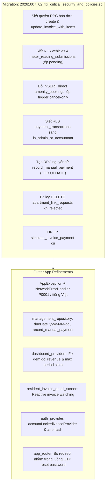

# Thiết Kế Chi Tiết: Khắc Phục Lỗ Hổng Bảo Mật CSDL & Lỗi Logic Nghiệp Vụ Toàn Diện

- **Ngày tạo:** 07/10/2026
- **Trạng thái:** Đã phê duyệt (Approved)
- **Phạm vi:** Database Security (RPCs, RLS, Triggers), Dart Business Logic (Error Handling, Due Date, Analytics, Router, Auth)
- **Files chính:**
  - `supabase/migrations/20261007_02_fix_critical_security_and_policies.sql`
  - `lib/core/errors/app_exception.dart`
  - `lib/core/utils/network_error_handler.dart`
  - `lib/data/repositories/management_repository.dart`
  - `lib/data/providers/dashboard_providers.dart`
  - `lib/data/providers/auth_provider.dart`
  - `lib/core/router/app_router.dart`
  - `lib/features/resident/screens/resident_invoice_detail_screen.dart`
  - `lib/features/management/screens/management_invoice_detail_screen.dart`

---

## 1. Bối cảnh & Vấn đề Cần Giải Quyết

Hệ thống đã triển khai các bản vá P0/P1 trước đó, tuy nhiên qua kiểm tra an ninh và logic chuyên sâu, phát hiện 2 nhóm vấn đề nghiêm trọng:

### 1.1. Lỗ Hổng Bảo Mật CSDL (Database Security Gaps)
1. **RPC Quản lý Hóa đơn thiếu kiểm tra quyền:** `create_invoice_with_items` và `update_invoice_with_items` là `SECURITY DEFINER` nhưng không có guard `is_admin_or_accountant()`, cho phép cư dân tự ý gọi RPC để cập nhật hóa đơn thành `paid` hoặc thay đổi tiền nợ.
2. **Cư dân tự duyệt xe:** Policy INSERT trên `vehicles` chỉ kiểm tra căn hộ, không kiểm tra `status = 'pending'` và `rejection_reason IS NULL`, dẫn đến việc người dùng có thể gửi `status = 'approved'` để xe được duyệt ngay lập tức.
3. **Cư dân tự duyệt chỉ số đồng hồ:** Policy INSERT trên `meter_reading_submissions` không ràng buộc `status = 'pending'` và `submitted_by = auth.uid()`.
4. **Qua mặt RPC đặt lịch tiện ích:** Policy INSERT trực tiếp `Cư dân đặt lịch tiện ích` vẫn còn mở trong khi unique index đã bị loại bỏ, cho phép chèn lịch trực tiếp bỏ qua kiểm tra sức chứa, bảo trì và danh sách chờ. Trigger UPDATE cũng chưa chặn cư dân sửa các cột nhạy cảm khác ngoài `status = 'cancelled'`.
5. **Quyền ghi giao dịch thanh toán quá rộng:** Policy `payment_transactions` dùng `is_staff()`, cấp quyền ghi/xóa giao dịch tài chính cho cả kỹ thuật viên (`technician`).
6. **Xác nhận thu tiền không nguyên tử:** BQL xác nhận thu tiền qua 2 lệnh client riêng biệt (`updateInvoiceStatus` và `recordPaymentTransaction`), gây rủi ro đứt đoạn dữ liệu hoặc tạo trùng giao dịch khi bấm đúp.
7. **Gửi lại yêu cầu liên kết căn hộ bị lỗi:** Thiếu policy DELETE cho cư dân đối với các yêu cầu đã bị từ chối (`status = 'rejected'`), dẫn đến vi phạm unique constraint khi cư dân nộp lại yêu cầu liên kết.
8. **RPC mô phỏng thanh toán cũ tồn đọng:** `simulate_invoice_payment` cũ cần được dọn dẹp khỏi CSDL.

### 1.2. Lỗi Logic Ứng Dụng Flutter (Dart Logic Issues)
1. **Format lỗi nuốt thông báo tiếng Việt:** `NetworkErrorHandler.getMessage` biến các `Exception('tiếng Việt')` thành fallback chung "Đã xảy ra lỗi", trong khi lại trả nguyên văn tiếng Anh kỹ thuật khi gặp lỗi cú pháp từ `PostgrestException`.
2. **Hạn thanh toán lệch ngày:** `generateValidBulkInvoices` gửi `dueDate.toIso8601String()` thay vì chuỗi ngày chuẩn `yyyy-MM-dd`.
3. **Biểu đồ doanh thu đếm đôi:** `monthlyRevenueTrendProvider` fallback theo `created_at` ngay cả khi hóa đơn đã khớp chu kỳ trước đó.
4. **Chọn sai chu kỳ thống kê:** `financialStatsProvider` chọn `invoices.first['period']` theo stream ngẫu nhiên thay vì tìm chu kỳ có thời gian lớn nhất.
5. **Chi tiết hóa đơn cư dân không tự làm mới:** `ResidentInvoiceDetailScreen` sử dụng `widget.invoice` tĩnh, không cập nhật sang `Đã thanh toán` sau khi hoàn tất thanh toán.
6. **Luồng khóa tài khoản & chớp màn hình:** `auth_provider.dart` bị ghi đè lỗi khóa tài khoản bởi sự kiện `signedOut` và bật nhầm cờ "Phiên hết hạn". Đồng thời đặt `loading` không cần thiết khi resume ứng dụng.
7. **Luồng quên mật khẩu bị redirect nhầm:** `app_router.dart` tự động redirect người dùng đang ở `/verify-otp` về trang chủ ngay khi OTP được xác thực thành công.

---

## 2. Thiết Kế Kiến Trúc & Chi Tiết Kỹ Thuật



### 2.1. CSDL & Migration

#### 1. RPC Hóa Đơn An Toàn
- Viết lại `public.create_invoice_with_items` và `public.update_invoice_with_items`:
  - Thêm guard đầu hàm:
    ```sql
    IF NOT public.is_admin_or_accountant() THEN
      RAISE EXCEPTION 'Bạn không có quyền thực hiện thao tác này';
    END IF;
    ```
  - Cấu hình phân quyền:
    ```sql
    REVOKE ALL ON FUNCTION public.create_invoice_with_items FROM anon, PUBLIC;
    REVOKE ALL ON FUNCTION public.update_invoice_with_items FROM anon, PUBLIC;
    GRANT EXECUTE ON FUNCTION public.create_invoice_with_items TO authenticated;
    GRANT EXECUTE ON FUNCTION public.update_invoice_with_items TO authenticated;
    ```

#### 2. RLS Phương Tiện (`vehicles`)
- Cập nhật policy INSERT:
  ```sql
  DROP POLICY IF EXISTS "Residents can insert vehicles for their apartment" ON public.vehicles;
  CREATE POLICY "Residents can insert vehicles for their apartment"
    ON public.vehicles FOR INSERT
    TO authenticated
    WITH CHECK (
      apartment_id IN (
        SELECT apartment_id FROM public.residents_apartments
        WHERE user_id = auth.uid()
      )
      AND status = 'pending'
      AND rejection_reason IS NULL
    );
  ```

#### 3. RLS Gửi Chỉ Số Đồng Hồ (`meter_reading_submissions`)
- Cập nhật policy INSERT:
  ```sql
  DROP POLICY IF EXISTS "Residents can insert meter submissions" ON public.meter_reading_submissions;
  CREATE POLICY "Residents can insert meter submissions"
    ON public.meter_reading_submissions FOR INSERT
    TO authenticated
    WITH CHECK (
      apartment_id IN (
        SELECT apartment_id FROM public.residents_apartments
        WHERE user_id = auth.uid()
      )
      AND status = 'pending'
      AND (submitted_by = auth.uid() OR submitted_by IS NULL)
    );
  ```

#### 4. Đặt Chỗ Tiện Ích (`amenity_bookings`)
- Bỏ quyền INSERT trực tiếp của cư dân:
  ```sql
  DROP POLICY IF EXISTS "Cư dân đặt lịch tiện ích" ON public.amenity_bookings;
  ```
  *(Cư dân bắt buộc gọi RPC `book_amenity_slot` để được kiểm tra dung lượng và lịch bảo trì).*
- Trigger bảo vệ khi cư dân cập nhật:
  ```sql
  CREATE OR REPLACE FUNCTION public.check_amenity_booking_resident_update()
  RETURNS TRIGGER AS $$
  BEGIN
    IF NOT public.is_staff_or_management() THEN
      IF NEW.status != 'cancelled' THEN
        RAISE EXCEPTION 'Cư dân chỉ được phép hủy lịch tiện ích';
      END IF;
      -- Đảm bảo không thay đổi bất kỳ trường nhạy cảm nào khác
      IF NEW.amenity_id IS DISTINCT FROM OLD.amenity_id OR
         NEW.booking_date IS DISTINCT FROM OLD.booking_date OR
         NEW.time_slot IS DISTINCT FROM OLD.time_slot OR
         NEW.fee_amount IS DISTINCT FROM OLD.fee_amount OR
         NEW.deposit_status IS DISTINCT FROM OLD.deposit_status OR
         NEW.booked_by IS DISTINCT FROM OLD.booked_by OR
         NEW.apartment_id IS DISTINCT FROM OLD.apartment_id THEN
        RAISE EXCEPTION 'Không được phép thay đổi thông tin đặt chỗ';
      END IF;
    END IF;
    RETURN NEW;
  END;
  $$ LANGUAGE plpgsql SECURITY DEFINER SET search_path = public, pg_catalog;
  ```

#### 5. Siết Quyền Giao Dịch Thanh Toán (`payment_transactions`)
- Cập nhật policy:
  ```sql
  DROP POLICY IF EXISTS "BQL quản lý giao dịch thanh toán" ON public.payment_transactions;
  CREATE POLICY "BQL quản lý giao dịch thanh toán" ON public.payment_transactions
    FOR ALL
    TO authenticated
    USING (public.is_admin_or_accountant());
  ```

#### 6. RPC Thu Tiền Nguyên Tử (`record_manual_payment`)
- Định nghĩa hàm:
  ```sql
  CREATE OR REPLACE FUNCTION public.record_manual_payment(
    p_invoice_id UUID,
    p_payment_method VARCHAR DEFAULT 'CASH',
    p_notes TEXT DEFAULT NULL
  )
  RETURNS JSONB
  LANGUAGE plpgsql
  SECURITY DEFINER
  SET search_path = public, pg_catalog
  AS $$
  DECLARE
    v_inv RECORD;
    v_txn_id UUID;
  BEGIN
    IF NOT public.is_admin_or_accountant() THEN
      RAISE EXCEPTION 'Bạn không có quyền xác nhận thu tiền';
    END IF;

    SELECT * INTO v_inv FROM public.invoices WHERE id = p_invoice_id FOR UPDATE;
    IF NOT FOUND THEN
      RAISE EXCEPTION 'Hóa đơn không tồn tại';
    END IF;

    IF v_inv.status = 'paid' THEN
      RAISE EXCEPTION 'Hóa đơn đã được thanh toán trước đó';
    END IF;

    UPDATE public.invoices
    SET status = 'paid',
        payment_method = p_payment_method,
        paid_at = NOW(),
        updated_at = NOW()
    WHERE id = p_invoice_id;

    INSERT INTO public.payment_transactions (
      invoice_id,
      apartment_id,
      amount,
      payment_method,
      status,
      title
    ) VALUES (
      p_invoice_id,
      v_inv.apartment_id,
      v_inv.total_amount,
      p_payment_method,
      'SUCCESS',
      COALESCE(p_notes, 'Thanh toán hóa đơn kỳ ' || v_inv.period)
    ) RETURNING id INTO v_txn_id;

    RETURN jsonb_build_object('success', true, 'invoice_id', p_invoice_id, 'transaction_id', v_txn_id);
  END;
  $$;

  REVOKE ALL ON FUNCTION public.record_manual_payment FROM anon, PUBLIC;
  GRANT EXECUTE ON FUNCTION public.record_manual_payment TO authenticated;
  ```

#### 7. Yêu Cầu Liên Kết Căn Hộ (`apartment_link_requests`)
- Bổ sung policy DELETE:
  ```sql
  DROP POLICY IF EXISTS "Cư dân xóa yêu cầu bị từ chối" ON public.apartment_link_requests;
  CREATE POLICY "Cư dân xóa yêu cầu bị từ chối"
    ON public.apartment_link_requests FOR DELETE
    TO authenticated
    USING (user_id = auth.uid() AND status = 'rejected');
  ```

#### 8. Xóa Bỏ RPC Cũ
  ```sql
  DROP FUNCTION IF EXISTS public.simulate_invoice_payment(UUID);
  ```

---

### 2.2. Logic Ứng Dụng Flutter

#### 1. Định Nghĩa & Chuẩn Hóa Lỗi
- Tạo `lib/core/errors/app_exception.dart`:
  ```dart
  class AppException implements Exception {
    final String message;
    const AppException(this.message);

    @override
    String toString() => message;
  }
  ```
- Nâng cấp `lib/core/utils/network_error_handler.dart`:
  - Thêm kiểm tra: `if (error is AppException) return error.message;`
  - Với `PostgrestException`:
    - Nếu `error.code == 'P0001'`: Trả về `error.message` (chuỗi tiếng Việt từ `RAISE EXCEPTION`).
    - Nếu `error.code == '23505'`: Trả về 'Dữ liệu hoặc khung giờ đã tồn tại trong hệ thống. Vui lòng kiểm tra lại.'
    - Nếu là các lỗi cú pháp/hạ tầng SQL khác: Trả về fallback thân thiện.
  - Thay thế các `throw Exception('...')` thông báo nghiệp vụ ở repositories sang `throw AppException('...')`.

#### 2. Format Ngày Hạn Thanh Toán & Dọn Dẹp Repository
- `lib/data/repositories/management_repository.dart`:
  - Trong `generateValidBulkInvoices`: Gửi `'p_due_date': dueDate.toIso8601String().split('T')[0]`.
  - Bổ sung phương thức gọi `record_manual_payment` thay thế cho 2 bước tách rời.
  - Xóa phương thức thừa `generateMonthlyBulkInvoices`.

#### 3. Thống Kê & Doanh Thu Chính Xác
- `lib/data/providers/dashboard_providers.dart`:
  - `monthlyRevenueTrendProvider`: Chỉ kiểm tra `created_at` khi `invPeriod.trim().isEmpty` hoặc định dạng chu kỳ không thể phân tích được thành `MM/yyyy`.
  - `financialStatsProvider`: Sắp xếp các chu kỳ theo `DateTime` để trích xuất kỳ lớn nhất thay vì lấy `invoices.first['period']`.

#### 4. Tự Động Cập Nhật Màn Hình Chi Tiết Hóa Đơn
- `lib/features/resident/screens/resident_invoice_detail_screen.dart`:
  - Xem và cập nhật hóa đơn thông qua stream `residentInvoicesStreamProvider` (lọc theo `widget.invoice.id`), để giao diện chuyển tức thì sang trạng thái `Đã thanh toán` khi thanh toán thành công.

#### 5. Luồng Quản Lý Phiên & Khóa Tài Khoản
- `lib/data/providers/auth_provider.dart`:
  - Tạo `final accountLockedNoticeProvider = StateProvider<bool>((ref) => false);`.
  - Khi phát hiện tài khoản bị khóa (`userModel.isLocked`), bật `accountLockedNoticeProvider` thành `true` và gọi logout có cờ manual.
  - Khi resume ứng dụng, nếu `state.valueOrNull?.id == userId`, giữ nguyên dữ liệu và làm mới ngầm, không gán lại `AsyncValue.loading()`.

#### 6. Luồng Điều Hướng Quên Mật Khẩu
- `lib/core/router/app_router.dart`:
  - Thêm điều kiện: nếu đang trong luồng xác thực OTP (`/verify-otp`) hoặc `/reset-password`, không kích hoạt auto-redirect về trang chủ resident/management.

---

## 3. Kế Hoạch Kiểm Thử & Xác Minh (Testing Strategy)

1. **Unit Tests (Core & Providers):**
   - Kiểm thử `NetworkErrorHandler` với `AppException`, `PostgrestException` mã `P0001`, `23505`, và các lỗi khác.
   - Kiểm thử `monthlyRevenueTrendProvider` không bị đếm trùng hóa đơn kỳ T9 tạo vào T10.
   - Kiểm thử `financialStatsProvider` chọn đúng kỳ lớn nhất bất kể thứ tự danh sách.
2. **Integration / Repository Tests:**
   - Kiểm thử gửi `due_date` dạng `yyyy-MM-dd` trong `generateValidBulkInvoices`.
   - Kiểm thử `record_manual_payment` được gọi nguyên tử từ màn hình chi tiết BQL.
3. **Full Suite Regression:**
   - Chạy `flutter test` đảm bảo 100% test cases (262+ tests) vượt qua thành công không lỗi lầm.
