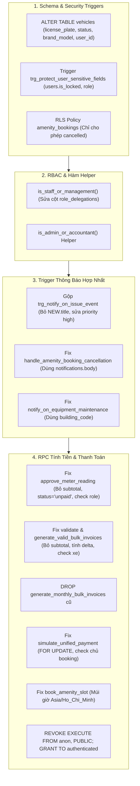

# Thiết Kế Chi Tiết: Khắc Phục Toàn Bộ Lỗi P0 Database, Migration, RPC, Trigger và Bảo Mật CSDL

- **Ngày tạo:** 07/10/2026
- **Trạng thái:** Dự thảo hoàn chỉnh (Chờ duyệt)
- **Phạm vi:** P0 (Database integrity, Security Definer, Concurrency, Billing accuracy, Timezone, Notification Triggers)
- **File Migration mục tiêu:** `supabase/migrations/20261007_01_fix_p0_database_and_security.sql`

---

## 1. Bối cảnh & Vấn đề Cốt lõi (P0)

Qua quá trình rà soát toàn diện CSDL và hệ thống backend Supabase, 6 nhóm lỗi nghiêm trọng sau đã được xác nhận:

1. **Lỗi chèn cột sinh tự động (`subtotal`) & Sai Enum (`pending`):**
   - Migration `20260909_01` đã chuyển `invoice_items.subtotal` sang cột sinh tự động: `GENERATED ALWAYS AS (unit_price * quantity) STORED`.
   - Các hàm `generate_valid_bulk_invoices`, `generate_monthly_bulk_invoices` và `approve_meter_reading` vẫn cố gắng chèn giá trị vào cột `subtotal`, khiến PostgreSQL văng lỗi runtime `cannot insert into column "subtotal"`.
   - `approve_meter_reading` chèn `status = 'pending'` vào bảng `invoices`, trong khi enum `invoice_status` chỉ chấp nhận `('unpaid', 'paid', 'overdue', 'cancelled')`.
2. **Trigger thông báo bị lỗi tham chiếu & xung đột trùng lặp:**
   - `trigger_notify_on_issue_status_change` gọi `NEW.title` của `issue_reports` trong khi bảng này chỉ có cột `description`. Mọi thao tác cập nhật trạng thái sự cố đều bị rollback do lỗi.
   - `trigger_notify_on_issue_lifecycle` so sánh `NEW.priority = 'urgent'`, trong khi enum `issue_priority` chỉ có `('low', 'medium', 'high')`.
   - `handle_amenity_booking_cancellation` chèn vào cột `content` của `notifications`, trong khi tên cột thực tế là `body`. Khi có hủy lịch với người trong danh sách chờ (waitlist), giao dịch bị rollback.
   - `is_staff_or_management()` gọi sai tên cột của bảng `role_delegations` (`delegate_user_id` thay vì `delegate_id`, `target_role` thay vì `delegated_role`, `start_time`/`end_time` thay vì `starts_at`/`ends_at`, và tham chiếu cột không tồn tại `status`).
   - `trigger_notify_on_equipment_maintenance` gọi `a.building` trong khi bảng `apartments` sử dụng `building_code`.
   - Có 2–3 trigger trùng lặp cùng bắt sự kiện trên `issue_reports` và `equipment_maintenance_tasks`.
3. **Lỗ hổng phân quyền & Security Definer:**
   - Các RPC `SECURITY DEFINER` gồm `approve_meter_reading`, `reject_meter_reading`, `validate_monthly_bulk_invoices`, `generate_valid_bulk_invoices`, `check_in_amenity_booking` không kiểm tra vai trò người gọi hàm ở đầu hàm, cho phép cư dân gọi trực tiếp để can thiệp hệ thống.
   - `simulate_unified_payment` thiếu mệnh đề `FOR UPDATE` gây nguy cơ race condition (double payment). Nhánh `SERVICE` không xác thực quyền sở hữu lịch đặt.
   - Bảng `users` thiếu trigger chặn cư dân tự cập nhật `is_locked = false` hoặc tự nâng `role`.
   - Cư dân có thể tự ý sửa `amenity_bookings.status` sang bất kỳ trạng thái nào qua RLS update thay vì chỉ được phép đổi sang `'cancelled'`.
4. **Sai lệch thuật toán tính hóa đơn & Lượng tiêu thụ:**
   - Hóa đơn hàng loạt lấy chỉ số đồng hồ tuyệt đối (`apartments.electric_reading`) làm lượng tiêu thụ thay vì tính hiệu số `(mới - cũ)`.
   - Căn hộ không có phương tiện vẫn bị tính mặc định 100.000 đ phí gửi xe.
   - Hàm `generate_monthly_bulk_invoices` cũ vẫn tồn tại song song gây nhầm lẫn với `generate_valid_bulk_invoices`.
5. **Lệch múi giờ (Timezone Offset):**
   - Hàm `book_amenity_slot` ép giờ `'08:00'::timestamptz` theo giờ UTC của máy chủ, làm sai lệch 7 giờ so với giờ Việt Nam (`Asia/Ho_Chi_Minh`), dẫn đến chặn sai các khung giờ đặt trong ngày.
6. **Không nhất quán Schema bảng `vehicles`:**
   - Migration `20260921_01` tạo bảng với `plate_number`, thiếu `status`. Migration `20261005_04` dùng `CREATE TABLE IF NOT EXISTS` với `license_plate` và `status`, khiến các cột này không bao giờ được tạo trên DB đã tồn tại bảng cũ.

---

## 2. Kiến Trúc & Thiết Kế Giải Pháp Chi Tiết

Tất cả các bản vá được đóng gói trong migration hợp nhất:
`supabase/migrations/20261007_01_fix_p0_database_and_security.sql`



### 2.1. Chuẩn Hóa Bảng `vehicles` & RLS Bảo Vệ `users`

1. **Bảng `vehicles`:**
   - Sử dụng `ALTER TABLE public.vehicles`:
     - Thêm `user_id UUID REFERENCES public.users(id) ON DELETE SET NULL`.
     - Thêm `license_plate TEXT`.
     - Thêm `brand_model TEXT`.
     - Thêm `status TEXT DEFAULT 'pending'`.
   - Di chuyển dữ liệu nếu tồn tại cột cũ:
     ```sql
     UPDATE public.vehicles
     SET license_plate = plate_number
     WHERE license_plate IS NULL AND plate_number IS NOT NULL;
     ```
   - Thêm ràng buộc kiểm tra hợp lệ:
     - `CHECK (status IN ('pending', 'approved', 'rejected'))`
     - `CHECK (vehicle_type IN ('motorbike', 'car', 'electric_bicycle'))`
2. **Trigger bảo vệ `users`:**
   - Tạo function `public.protect_user_sensitive_fields()`:
     - Nếu `auth.uid() = NEW.id` (cư dân tự sửa hồ sơ của mình) và người đó không có role `admin` hoặc `management`:
       - Nếu `OLD.is_locked IS DISTINCT FROM NEW.is_locked` -> `RAISE EXCEPTION 'Bạn không có quyền thay đổi trạng thái khóa tài khoản';`
       - Nếu `OLD.role IS DISTINCT FROM NEW.role` -> `RAISE EXCEPTION 'Bạn không có quyền tự thay đổi vai trò hệ thống';`
   - Đặt trigger `BEFORE UPDATE ON public.users FOR EACH ROW`.
3. **RLS Policy cho `amenity_bookings`:**
   - Cư dân chỉ được phép sửa đơn đặt tiện ích của chính mình khi `NEW.status = 'cancelled'`. Mọi nỗ lực đổi sang trạng thái khác sẽ bị từ chối bởi RLS `WITH CHECK (status = 'cancelled')`.

### 2.2. Sửa Hàm Phân Quyền `is_staff_or_management()`

Sửa lại truy vấn bảng `role_delegations` để khớp chuẩn xác 100% với schema thực tế:
```sql
CREATE OR REPLACE FUNCTION public.is_staff_or_management()
RETURNS BOOLEAN
LANGUAGE sql
STABLE
SECURITY DEFINER
SET search_path = public
AS $$
  SELECT EXISTS (
    SELECT 1 FROM public.users
    WHERE id = auth.uid()
      AND (
        role IN ('management', 'admin', 'technician')
        OR EXISTS (
          SELECT 1 FROM public.role_delegations rd
          WHERE rd.delegate_id = auth.uid()
            AND rd.delegated_role IN ('management', 'admin', 'technician')
            AND now() BETWEEN rd.starts_at AND rd.ends_at
        )
      )
  );
$$;
```

Bổ sung helper kiểm tra quyền tài chính:
```sql
CREATE OR REPLACE FUNCTION public.is_admin_or_accountant()
RETURNS BOOLEAN
LANGUAGE sql
STABLE
SECURITY DEFINER
SET search_path = public
AS $$
  SELECT EXISTS (
    SELECT 1 FROM public.users
    WHERE id = auth.uid()
      AND (
        role IN ('admin', 'accountant', 'management')
        OR EXISTS (
          SELECT 1 FROM public.role_delegations rd
          WHERE rd.delegate_id = auth.uid()
            AND rd.delegated_role IN ('accountant')
            AND now() BETWEEN rd.starts_at AND rd.ends_at
        )
      )
  );
$$;
```

### 2.3. Hợp Nhất & Sửa Lỗi Toàn Bộ Trigger Thông Báo

1. **Trigger Phản Ánh Sự Cố (`issue_reports`):**
   - Xóa bỏ các trigger phân mảnh cũ:
     - `DROP TRIGGER IF EXISTS trg_notify_on_issue_status_change ON public.issue_reports;`
     - `DROP TRIGGER IF EXISTS trg_notify_on_issue_lifecycle ON public.issue_reports;`
   - Tạo một trigger thống nhất `trg_notify_on_issue_event`:
     - **INSERT:**
       - Kiểm tra `IF NEW.priority = 'high'` (sửa enum từ `'urgent'` thành `'high'`).
       - Tiêu đề: `🚨 PHẢN ÁNH KHẨN: Căn hộ ...` hoặc `Phản ánh sự cố mới: Căn hộ ...`.
       - Nội dung: Lấy `LEFT(COALESCE(NEW.description, '...'), 120)`.
       - Gửi thông báo đến người dùng có role `admin`, `management`, `technician`.
     - **UPDATE:**
       - Khi `OLD.status IS DISTINCT FROM NEW.status`:
         - Bỏ hoàn toàn `NEW.title` (gây lỗi runtime).
         - Thay bằng: `Phản ánh sự cố ("' || LEFT(COALESCE(NEW.description, ''), 30) || '...") của bạn đã được cập nhật sang trạng thái: ...`.
         - Gửi thông báo cho `NEW.reporter_id`.
       - Khi `OLD.assigned_staff_id IS DISTINCT FROM NEW.assigned_staff_id` và `NEW.assigned_staff_id IS NOT NULL`:
         - Gửi thông báo phân công công việc cho kỹ thuật viên được giao việc.
2. **Trigger Hủy Lịch Tiện Ích (`handle_amenity_booking_cancellation`):**
   - Sửa câu lệnh `INSERT INTO public.notifications`: đổi cột `content` thành `body`.
3. **Trigger Bảo Trì Thiết Bị (`trigger_notify_on_equipment_maintenance`):**
   - Sửa điều kiện quét căn hộ: dùng `a.building_code = v_building` thay vì `a.building`.

### 2.4. Khắc Phục RPC Tính Tiền, Duyệt Chỉ Số & Quản Lý Hóa Đơn

1. **Hàm `approve_meter_reading`:**
   - Thêm guard: `IF NOT (public.is_staff_or_management() OR public.is_admin_or_accountant()) THEN RAISE EXCEPTION 'Không có quyền duyệt chỉ số đồng hồ'; END IF;`
   - Sửa `INSERT INTO public.invoices`: dùng `status = 'unpaid'` (thay vì `'pending'`).
   - Sửa `INSERT INTO public.invoice_items`: bỏ hoàn toàn cột `subtotal`. Cột `subtotal` sẽ được hệ quản trị PostgreSQL tự động tính bằng `(unit_price * quantity)`.
   - Tính phí gửi xe chính xác: Đếm số lượng xe có `status = 'approved'`. Nếu phí gửi xe = 0 thì không chèn dòng 'Phí gửi xe'.
2. **Hàm `reject_meter_reading`:**
   - Thêm guard kiểm tra quyền quản lý/kỹ thuật.
3. **Hàm `validate_monthly_bulk_invoices` & `generate_valid_bulk_invoices`:**
   - Thêm guard kiểm tra quyền `public.is_admin_or_accountant()`.
   - Bỏ cột `subtotal` trong `INSERT INTO public.invoice_items`.
   - Khắc phục tính lượng tiêu thụ điện/nước:
     - So sánh số mới từ chỉ số hiện tại với chỉ số đã chốt kỳ trước (`GREATEST(0, new_reading - old_reading)`). Nếu chưa có số kỳ trước thì lấy chênh lệch từ bản ghi `meter_reading_submissions` đã duyệt gần nhất.
   - Phí gửi xe: Chỉ tính cho căn hộ có xe đang ở trạng thái `status = 'approved'`. Căn hộ không có xe duyệt thì phí gửi xe = 0.
4. **Dọn dẹp hàm cũ:**
   - Chạy `DROP FUNCTION IF EXISTS public.generate_monthly_bulk_invoices(TEXT, DATE, NUMERIC, NUMERIC, NUMERIC);` để loại bỏ phiên bản cũ nhiều lỗi, chỉ dùng duy nhất bộ đôi `validate_monthly_bulk_invoices` và `generate_valid_bulk_invoices`.

### 2.5. Bảo Mật RPC, Chống Race Condition & Múi Giờ

1. **Hàm `simulate_unified_payment`:**
   - Khóa dòng chống double payment:
     - Khi lấy hóa đơn: `SELECT ... FROM public.invoices WHERE id = p_reference_id FOR UPDATE;`
     - Khi lấy đặt chỗ tiện ích: `SELECT ... FROM public.amenity_bookings WHERE id = p_reference_id FOR UPDATE;`
   - Xác thực quyền sở hữu với dịch vụ: Kiểm tra `v_booking.booked_by = auth.uid()` hoặc người gọi là quản lý trước khi cho phép thanh toán.
   - Thêm cờ bảo vệ: Kiểm tra nếu trạng thái đã là `'paid'` / `'confirmed'` thì báo lỗi ngay, không thực hiện ghi trùng giao dịch.
2. **Hàm `check_in_amenity_booking`:**
   - Thêm guard: `IF NOT public.is_staff_or_management() THEN RAISE EXCEPTION 'Chỉ Ban Quản Lý hoặc Nhân viên mới có quyền Check-in'; END IF;`
3. **Hàm `book_amenity_slot`:**
   - Xử lý múi giờ: Chuyển đổi chuỗi ngày và giờ thành timestamp theo múi giờ Việt Nam trước khi so sánh với `NOW()`:
     ```sql
     v_slot_start_time := (p_booking_date || ' ' || split_part(p_time_slot, '-', 1))::timestamp AT TIME ZONE 'Asia/Ho_Chi_Minh';
     IF v_slot_start_time < NOW() THEN
         RAISE EXCEPTION 'Khung giờ đặt đã trôi qua so với thời gian hiện tại';
     END IF;
     ```
4. **Phân quyền thực thi hàm (Hardening Permissions):**
   - `REVOKE ALL ON FUNCTION public.approve_meter_reading FROM anon, PUBLIC;`
   - `REVOKE ALL ON FUNCTION public.reject_meter_reading FROM anon, PUBLIC;`
   - `REVOKE ALL ON FUNCTION public.validate_monthly_bulk_invoices FROM anon, PUBLIC;`
   - `REVOKE ALL ON FUNCTION public.generate_valid_bulk_invoices FROM anon, PUBLIC;`
   - `REVOKE ALL ON FUNCTION public.check_in_amenity_booking FROM anon, PUBLIC;`
   - `GRANT EXECUTE ON FUNCTION ... TO authenticated;`

---

## 3. Kế Hoạch Kiểm Thử & Xác Minh (Verification)

1. **Kiểm tra cú pháp SQL:** Kiểm tra toàn bộ mã lệnh migration không có lỗi cú pháp, câu lệnh DROP/CREATE/ALTER idempotent an toàn.
2. **Xác minh Schema & RLS:**
   - Kiểm tra bảng `vehicles` có đầy đủ các cột: `license_plate`, `status`, `brand_model`, `user_id`.
   - Kiểm tra trigger bảo vệ `users.is_locked` hoạt động đúng.
3. **Xác minh Triggers:**
   - Tạo thử phản ánh sự cố mới và cập nhật trạng thái sự cố -> Đảm bảo không còn văng lỗi `record "new" has no field "title"` và `priority = 'urgent'`.
   - Hủy lịch tiện ích có waitlist -> Đảm bảo thông báo gửi thành công qua cột `body`.
4. **Xác minh RPC Tính Tiền:**
   - Duyệt chỉ số hoặc tạo hóa đơn hàng loạt -> Đảm bảo chèn `invoice_items` thành công không có lỗi `cannot insert into column "subtotal"`.
   - Kiểm tra `invoices.status = 'unpaid'`.
   - Kiểm tra căn hộ không có xe không bị tính phí xe.
